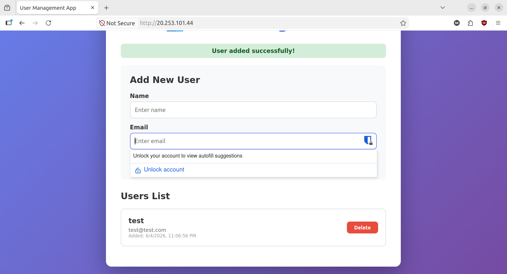
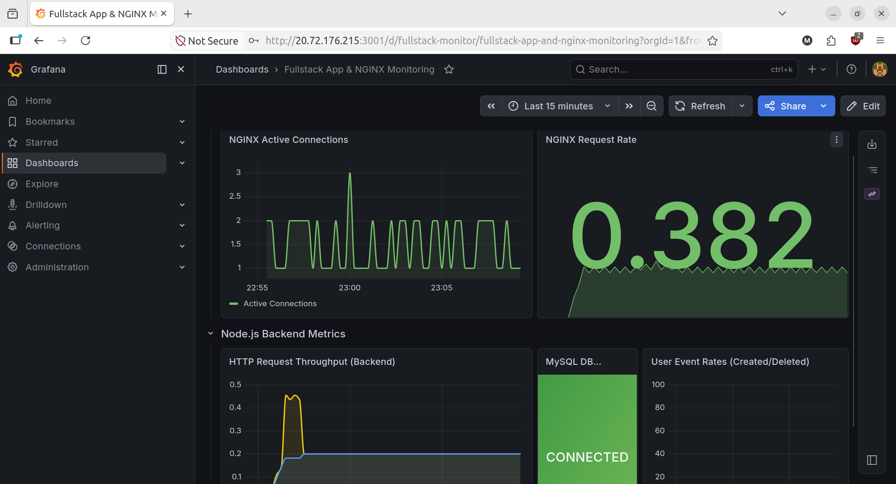

# 👥 Kamka — Containerized Fullstack Application

A production-grade, containerized fullstack web application equipped with REST APIs, vanilla HTML/CSS frontend, a comprehensive Prometheus/Grafana observability stack, and a robust health-checked deployment script with automatic rollback capabilities.

---

## 🏗️ Architecture & Stack Overview

```
                        [ Internet ]
                             │
                             ▼ (Port 80)
                     ┌───────────────┐
                     │     NGINX     │
                     │  (Frontend)   │
                     └───────────────┘
                       /           \
         (Internal proxy)           (Static HTML/CSS)
                      /               \
                     ▼                 ▼
             ┌───────────────┐   ┌───────────────┐
             │    Express    │   │  User portal  │
             │   (Backend)   │   │  (index.html) │
             └───────────────┘   └───────────────┘
                     │
                     ▼
             ┌───────────────┐
             │     MySQL     │
             │  (Database)   │
             └───────────────┘
```

- **Frontend**: Nginx serving static assets and reverse proxying `/api/*` requests internally.
- **Backend**: Express.js REST API with database pooling and Prometheus instrumentation.
- **Database**: MySQL 8.0 with automated schema migrations.
- **Observability**: Prometheus scraping Nginx, Backend, & MySQL endpoints; Grafana dashboards.
- **CI/CD**: GitHub Actions matrix workflow with smart path-based conditional cache gating.

### 📸 Application Screenshots

#### Web Application User Portal


#### Grafana Observability Dashboard


---

## 🚀 Quick Start (Development Mode)

Get the application up and running locally in development mode in under 2 minutes:

### 1. Configure Environment
Clone the repository and copy the env configuration file:
```bash
cd fullstack-app
cp .env.example .env
```

### 2. Boot Up the Cluster
Spin up all services in development mode:
```bash
docker compose up --build
```

### 3. Access Local Endpoints
- **Web UI**: [http://localhost:8080](http://localhost:8080)
- **API Status**: [http://localhost:3000/health](http://localhost:3000/health)
- **Prometheus Metrics**: [http://localhost:3000/metrics](http://localhost:3000/metrics)
- **Grafana Dashboards**: [http://localhost:3001](http://localhost:3001)

---

## 🔒 Hardened Production Deployment

To run in a secure, hardened production mode, use the production compose override file:
```bash
docker compose -f docker-compose.yml -f docker-compose.prod.yml up -d --build
```

### Production Security & Parity Features:
- **Zero Exposed Dev Ports**: Closes public ports for MySQL (`3306`), Backend (`3000`), Exporters (`9113`, `9104`), and Prometheus (`9090`). Only Nginx (`80`) and Grafana (`3001`) are exposed.
- **Resource Constraints**: Limits CPU and Memory allocations for core services (e.g., MySQL capped at 512MB RAM, Express at 256MB).
- **Auto-Recovery**: Containers use `restart: always` to recover from failure or system reboots.

---

## 🔄 Automated Rolling Deployments & Rollbacks

We provide a production-grade Bash deployment script ([deploy.sh](file:///home/chameau/Desktop/Kamka/fullstack-app/scripts/deploy.sh)) that handles rolling updates, native container healthchecks, and automated rollbacks on failure.

### Usage
```bash
./scripts/deploy.sh <tag>
```

### How to Test Deploy and Rollback (Local Sandbox)

To verify the deployment orchestration without pushing to a remote registry, follow these sandbox steps:

#### 1. Build and Tag Healthy Release (`1`)
```bash
docker tag fullstack-app-backend-service ichameau/fullstack-backend:1
docker tag fullstack-app-frontend-service ichameau/fullstack-frontend:1
```

#### 2. Run Deploy for `1`
```bash
./scripts/deploy.sh 1
```
*Result: The script will pull the tag locally, trigger sequential rolling replacement of the containers, wait for the Docker healthcheck status to become `healthy`, and complete.*

#### 3. Build the Broken Release (`error`)
We have pre-configured sandbox folders `backend-error/` and `frontend-error/` containing misconfigured health parameters:
```bash
# Build the faulty images
docker build -t ichameau/fullstack-backend:error ./backend-error
docker build -t ichameau/fullstack-frontend:error ./frontend-error
```

#### 4. Test Deploy and Auto-Rollback
Deploy the faulty `error` release tag:
```bash
./scripts/deploy.sh error
```
*Result: The deployment script begins upgrading the backend container. It polls the container health state, detects it remains `unhealthy` (due to the simulated HTTP 500 configuration), aborts the deployment, and immediately rolls back both services to the previous stable release (`1` / `7`) tags.*

---

## ☸️ Azure Kubernetes Service (AKS) Deployment

You can deploy the full application stack to **Azure Kubernetes Service (AKS)** using the pre-configured manifests in the [kubernetes/](file:///home/chameau/Desktop/Kamka/fullstack-app/kubernetes) directory.

### 1. Prerequisites & CLI Setup
Ensure you have the [Azure CLI](https://learn.microsoft.com/en-us/cli/azure/install-azure-cli) and [kubectl](https://kubernetes.io/docs/tasks/tools/) installed.

Log in to Azure and download the configuration credentials for your AKS cluster:
```bash
az login
az aks get-credentials --resource-group <your-resource-group> --name <your-aks-cluster-name>
```

### 2. Configure Secrets & Storage
We use Kubernetes Secrets to manage database and dashboard credentials securely.

1. Create the database credentials secret:
```bash
kubectl create secret generic db-secrets \
  --from-literal=mysql-root-password="your-root-password" \
  --from-literal=mysql-database="fullstack_db" \
  --from-literal=mysql-user="appuser" \
  --from-literal=mysql-password="your-db-password"
```

2. Create the Grafana admin credentials secret:
```bash
kubectl create secret generic grafana-secrets \
  --from-literal=admin-user="admin" \
  --from-literal=admin-password="your-grafana-password"
```

3. Deploy the PersistentVolumeClaim (PVC) and MySQL database:
```bash
kubectl apply -f kubernetes/mysql.yaml
```
*This dynamically provisions an Azure Managed Disk using the standard CSI storage class and mounts it at `/var/lib/mysql` to preserve database states.*

### 3. Deploy Application Services
Apply the backend and frontend manifests:
```bash
kubectl apply -f kubernetes/backend.yaml
kubectl apply -f kubernetes/frontend.yaml
```

### 4. Deploy Monitoring Stack
Apply Prometheus, Grafana, and Exporters:
```bash
kubectl apply -f kubernetes/monitoring.yaml
```

### 5. Access the Services
Retrieve the public IP addresses assigned by the Azure Load Balancer for the Frontend and Grafana:
```bash
# Get Frontend Web Portal IP (Accessible on Port 80)
kubectl get service frontend-service

# Get Grafana Dashboard IP (Accessible on Port 3001)
kubectl get service grafana
```

---

## 🛠️ Azure Kubernetes Service (AKS) Deployment via Terraform

Alternatively, you can deploy the entire Kubernetes infrastructure using the pre-configured HCL files in the [terraform/](file:///home/chameau/Desktop/Kamka/fullstack-app/terraform) directory.

### 1. Configure Secrets & Credentials
Modify your custom credentials inside the gitignored [terraform.tfvars](file:///home/chameau/Desktop/Kamka/fullstack-app/terraform/terraform.tfvars) file:
```hcl
mysql_root_password    = "your-secure-root-password"
mysql_database         = "fullstack_db"
mysql_user             = "appuser"
mysql_password         = "your-secure-user-password"

grafana_admin_user     = "admin"
grafana_admin_password = "your-secure-grafana-password"
```

### 2. Run Terraform Apply
Navigate to the Terraform folder, initialize the providers, and apply the resource configuration:
```bash
cd terraform
terraform init
terraform apply
```

### 3. Access Deployed IP Outputs
Terraform will automatically outputs the public IP endpoints upon completion:
```bash
frontend_public_ip = "..."
grafana_public_ip  = "..."
```

## 🔗 GitHub Actions CI/CD Pipeline

The GitHub Actions workflow in `.github/workflows/docker-publish.yml` automatically:
1. Performs backend linting and unit testing on pull requests targeting `master`.
2. Builds, tags (using standard versioning and commit SHAs), and pushes the updated Docker images to Docker Hub upon merges to `master`.
3. Performs a Continuous Deployment (CD) update to the active **Azure Kubernetes Service (AKS)** cluster using `kubectl`.

### Required GitHub Secrets
To enable the CI/CD pipeline, go to your GitHub repository **Settings > Secrets and variables > Actions** and add the following repository secrets:

| Secret Name | Description |
| :--- | :--- |
| `DOCKERHUB_USERNAME` | Your Docker Hub registry username |
| `DOCKERHUB_TOKEN` | A Docker Hub Access Token with write permissions |
| `KUBE_CONFIG_DATA` | Your Kubernetes credentials config file in base64 format. Generate it using:<br>`cat ~/.kube/config \| base64 -w 0` |

---

## 🧪 Testing & Linting

### Unit & Integration Tests
Run the Express REST API Jest test suite:
```bash
cd backend
npm install
npm test
```

### Linting
Check code style rules with ESLint:
```bash
cd backend
npm run lint
```
